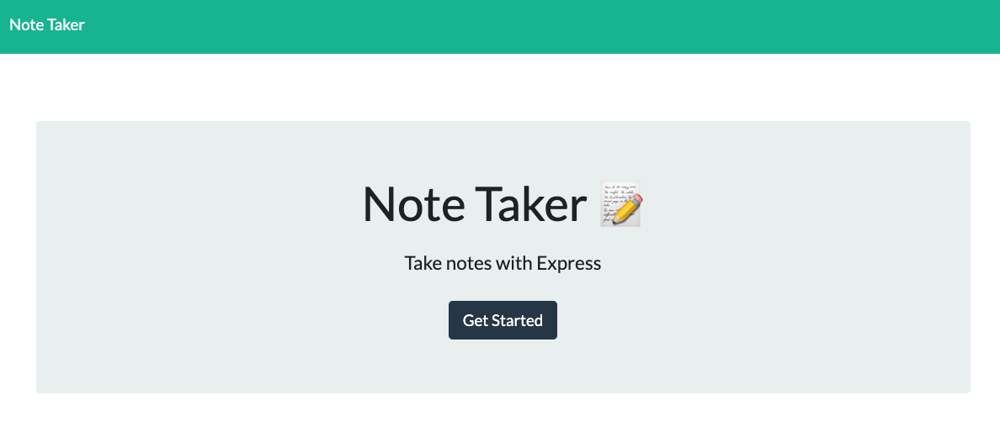

# Express.js: Note Taker

## Description
An application that allows user to write, save and delete notes. This application uses express.js and can retrieve/modify data from a JSON file. 

## Deployed application 

[Heroku link](https://note-takr-an.herokuapp.com/)

## Technology
1. Express.js
2. Node.js
3. JavaScript

